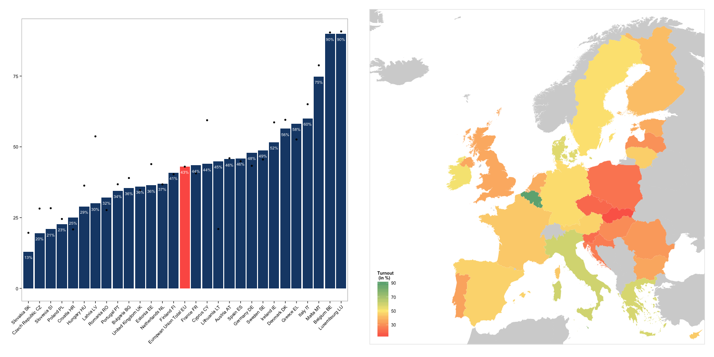
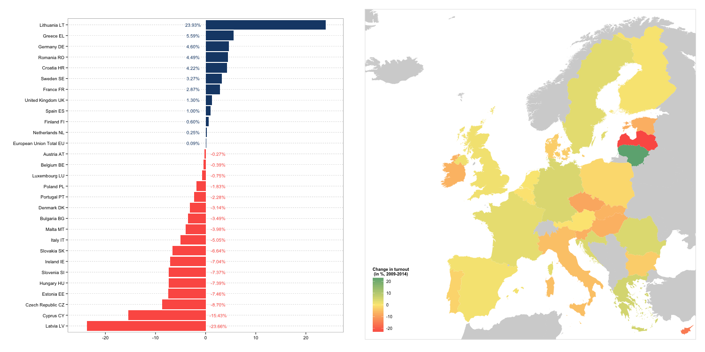

# Visualization of the 8th European election's turnout (2014)

Based on available [estimations](http://www.results-elections2014.eu/en/turnout.html), this R script visualizes the European election turnout as well as changes in turnout between 2009 and 2014 on a map.

## R-Code

The code for drawing the map is based on instructions from [here](http://f.briatte.org/teaching/ida/100_maps.html) and [here](https://github.com/hadley/ggplot2/wiki/plotting-polygon-shapefiles).

Shapefiles for the maps are provided by [Eurostat](http://epp.eurostat.ec.europa.eu/portal/page/portal/gisco_Geographical_information_maps/popups/references/administrative_units_statistical_units_1).

Basic code to draw the map is the following:

```
map <- readShapeSpatial("shapefile/CNTR_RG_60M_2006", proj4string = CRS("+proj=longlat"))
map <- rename(map, c(CNTR_ID = "iso2"))
map@data$id <- rownames(map@data)
map.points <- fortify(map, region = "id")
map.df <- join(map.points, map@data, by = "id")
map.df <- join(map.df, turnout, by = "iso2")

ggplot(map.df) +
  coord_cartesian(xlim = c(-24, 35), ylim = c(34, 72)) + # Coordinates for the EU
  aes(long, lat, group = group) + geom_path() + geom_polygon() +
  aes(fill = map.df$X2014_25.05.14_23.58.CEST)
```

See the [R code](https://github.com/n-klotz/European-Election-Turnout-Visualization-2014/blob/master/Vote%20Turnout%20EP%202014.R) for details about customizating this basic plot/map.

## Result




